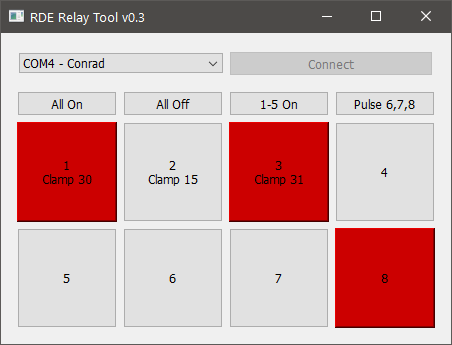

## RDE Relay Tool

This tool controls Conrad Components 197720 Relay Cards via USB-to-UART connection.

Please install the driver provided on the Conrad article page.




The chaining of multiple relay cards is not yet supported.

## Binary Building with PyInstaller

Windows:

```powershell
python -m PyInstaller --icon=favicon.ico --noconsole --onefile .\gui_relay_card.py
```

Pre-build binaries for Windows x64 are available in the Release section of this repository.

## Config

After starting the tool for the first time a config file will be created with the filename `relay_config.json` .

Example config:

```json
{
    "labels" : [ "Clamp 30", "Clamp 15", "Clamp 31" ],
    "buttons": [
        {
            "action": "activate",
            "label": "All On",
            "targets" : [1, 2, 3, 4, 5, 6, 7, 8]
        },
        {
            "action": "deactivate",
            "label": "All Off",
            "targets" : [1, 2, 3, 4, 5, 6, 7, 8]
        },
        {
            "action": "pulse",
            "label": "Pulse 6,7,8",
            "targets" : [6, 7, 8],
            "duration": 500
        }
    ]
}
```

Currently allowed actions for custom buttons are `activate`, `deactivate` and `pulse`. 

The `pulse` action will activate the specified relays simultaneously for a given duration (default: 500 ms) and then disable the given relays again.

### Changelog

#### v0.3

* Added special button configuration via config file
* Added connection specific error popups
* Application does not need to be restarted anymore after a failed connection attempt

#### v0.2

* Added config file
* Added labels for relay buttons